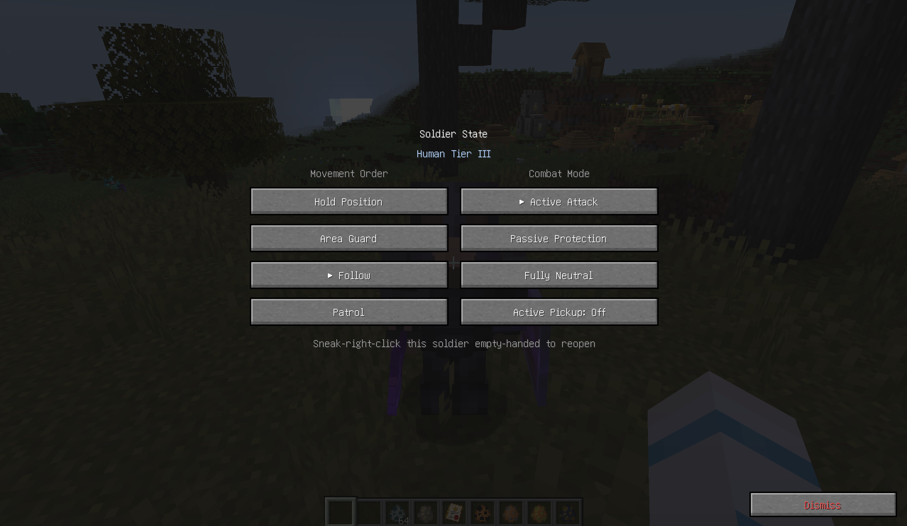
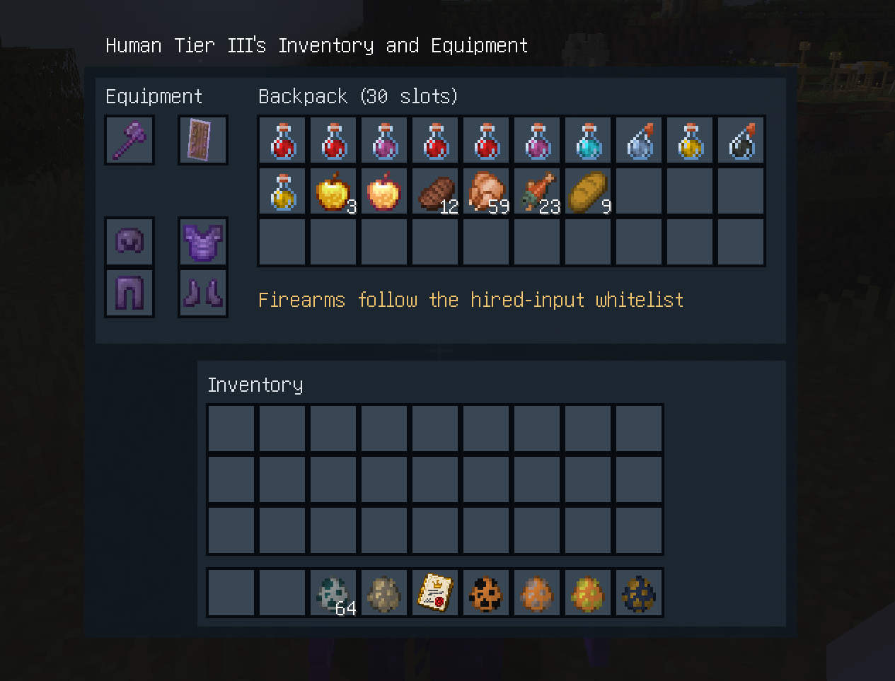

# Hostile Humans Unified 3.1.25-unified

[简体中文](README.md) | [English](README.en.md)

This mod is derived from the original [**Hostile Humans**](https://www.curseforge.com/minecraft/mc-mods/hostile-humans) mod and integrates content from **Human Gunner**. It also introduces original content created specifically for this mod. GPT assisted with modifying and building this mod. It is a standalone mod and can be installed on its own; the original Hostile Humans and Human Gunner JARs are not required. This is a third-party maintained version, not an official update from the original author. Most stats and mechanics of hostile humans have been strengthened, so the mod may be challenging in a mostly vanilla environment. Playing it alongside other mods or as part of a modpack is recommended.

Designed for **Minecraft 1.20.1, Forge 47.4.16, and Java 17**. Install one unified mod JAR. TaCZ and Curios are optional integrations: TaCZ enables firearm support, while Curios adds a dedicated accessory slot for identity badges.

## Overview

The mod adds human units in four ranks: Roamers, Tier I, Tier II, and Tier III. Their relationship with players depends on rank, identity badges, and recruitment status. Wild humans may be hostile, neutral, or protective, while eligible humans can be hired as companions.

Identity badges work from any inventory slot. With Curios installed, they can also be placed in the dedicated badge slot. Higher-level badges affect more ranks, and the Ultimate Identity Badge makes all human ranks protect its holder.

Hired humans can be ordered to follow, guard an area, hold their position, or patrol. Their combat behavior can be set to Aggressive, Passive Protection, or Fully Neutral (self-defense only). You can open a hired human's inventory to manage equipment, choose whether they actively pick up items, or dismiss them.

### Screenshots

**Hired human command panel**



**Hired human inventory and equipment screen**



Humans can fight with melee weapons, shields, bows, crossbows, tridents, and—when TaCZ is installed and enabled—compatible firearms. Ranged units adjust their combat behavior to their weapon. Hired companions may retreat to recover at low health and warn their owner when critically injured.

## Signal Items

- **Radio:** View your hired roster and command your companions to return or be located.
- **Reinforcement flares:** Call temporary friendly reinforcements. They leave when the support duration expires unless you formally hire them before then.
- **Hostile beacons:** Summon enemy human units at a distance to challenge the player.

## Configuration

The main configuration file is `config/hostile_humans_unified.json`. It covers rank attributes and ranged spread, damage multipliers, natural spawning, combat AI, hiring limits, PvP damage for hired humans, and TaCZ firearm settings. Restart the game after changing it. In multiplayer, the server configuration controls gameplay.

The detailed field-by-field configuration guide is currently available in [Chinese](CONFIGURATION.md).

## Compatibility

This unified version runs as a standalone Forge mod and does not require the original Hostile Humans or Human Gunner mod JARs. TaCZ and Curios are optional. The mod targets Minecraft 1.20.1 and Forge 47.4.16.

## Maintenance Notes

- The maintained version is defined in `build.gradle`. Rebuild and perform appropriate acceptance checks after every source change; previous test results do not validate a new build.
- The compatibility baseline is Minecraft 1.20.1, Forge 47.4.16, and Java 17. TaCZ and Curios are optional integrations. Without TaCZ, humans use the regular weapon AI.
- The unified configuration is `config/hostile_humans_unified.json`. Older standalone/base mod versions do not read this unified configuration. Structure integration settings such as Waystones remain in `config/hostile_humans.toml`.
- Default configuration values are in `src/main/resources/defaults/hostile_humans_unified.json`; see [`CONFIGURATION.md`](CONFIGURATION.md) for field-by-field guidance.
- Provenance and third-party notices are documented in `provenance.json`, `NOTICE.md`, and `src/main/resources/THIRD_PARTY_NOTICES.md`.
- Do not commit local `build/`, `.gradle/`, `logs/`, saves, or modpack files. Common generated files are excluded by `.gitignore`.

## Why Two Mod IDs Are Retained

The unified JAR retains both the `hostile_humans` and `humangunner` Forge mod IDs to preserve entity, item, recipe, configuration, and save references. The mod list may therefore show two entries, but there is only one unified JAR; it does not inject code into a separately installed copy of the original mod. Retaining legacy package names is a compatibility measure, not a dependency on the old binaries. The network protocol has changed, so new and old client/server versions cannot be mixed.

## Modules and Maintenance Locations

Java paths below are relative to `src/main/java`.

| Module | Responsibility | Main source location |
|---|---|---|
| Ownership index | Assign, look up, and list owners and members; migrate/remove index entries and provide immutable snapshots | `dev/felix/hostilehumans/core/OwnerIndex` |
| Update queue | Merge duplicate update requests, preserve FIFO order, and enforce a per-tick budget | `dev/felix/hostilehumans/core/BudgetedUpdates` |
| Saved data | Preserve the `HumanMobs` data format and save per world without a static server singleton | `entity/data/HumanServerData` |
| Lifecycle | Queue only UUIDs and dimensions, avoid retaining entity references, and release queues on shutdown | `entity/data/HumanManagerEventHandler` |
| Command networking | Validate direction, string length, ownership, distance, session, and request rate | `network/` and `HumanCommandNetwork` |
| Combat | Install weapon goals once and call them directly; restore temporary combo attributes in `finally` blocks | `entity/entities/Human` and the `humangunner` combat classes |
| Navigation | Use human-specific node classification and budget limits without changing other mobs | `entity/ai/HumanNavigation` |
| Spawning and positions | Natural-spawn admission, group budgets, signal items, and safe landing in already-loaded chunks | `NaturalHumanSpawnRules` / `SafePositions` |
| Survival relationships | Identity badges, contracts, formal hiring records, temporary reinforcements, and soldier commands | `humangunner` relationship classes |
| External adapters | The limited hooks needed for Minecraft and third-party mod compatibility | The two mixin packages |

Internal mixins have been moved into the maintained source tree. The project retains 13 compatibility classes for Minecraft and third-party mods; there are no internal injections targeting old `hostile_humans` or `humangunner` classes. Mature AI implementations are maintained and adapted rather than wholly re-created. Deprecated Forge 1.20.1 compatibility APIs remain, so this should not be interpreted as a claim of zero legacy code, zero risk, or guaranteed TPS improvements.

## Key Changes

- Removed startup network downloads of name lists. Existing local name files are read in a limited manner; the mod makes no outbound request for them and does not rewrite the cache.
- Changed the ownership index to instance-scoped saved data. Owner changes remove stale entries, and deletion no longer scans every player.
- Preserve the original NBT for damaged or unsupported individual records instead of discarding the entire data file when one record fails.
- Removed strong references from data objects to entities and dimensions; client-side data is cleared when the client exits.
- Route regular updates through a queue capped at 32 entries per server tick. Registration, logout, and explicit business-state changes can still save immediately.
- Removed the cross-player shared previous-packet cache; list synchronization can now clear a list, and the formerly empty single-entry client handler is implemented.
- Async world generation no longer accesses `SavedData`. Required equipment initialization is deferred to the entity's first server tick instead of discarding the entity.
- Bows, crossbows, guns, and tridents use direct combat implementations. Goal selectors are not modified during combat, and combo behavior no longer overwrites base attack values.
- When idle without a target, TaCZ gun users reload their main-hand firearm through the native reload flow. The client plays that firearm's empty-magazine or tactical reload sound.
- Removed the old duplicate trident-return path while retaining projectile pickup prevention and timed cleanup.
- Reduced the navigation-node multiplier from 50 to 2 and removed the global high-frequency path-recalculation patch for humans.
- Chest searches inspect block entities in loaded chunks, check at most 1,024 entries per pass, and no longer scan 16,000 blocks. Chest reservations are world-scoped, with expired reservations cleaned at most once every 20 ticks.
- Temporary reinforcements can be formally hired by their summoner during the support period; otherwise they are removed when it expires. Commands are processed once per tick, guard/patrol do not require the owner to stay online, and teleport/patrol avoids blindly loading chunks or using cave-roof height.
- Equipment configuration reloads replace immutable snapshots atomically while preserving existing firearm settings and survival values.
- Retained five friendly identity badges, four contracts, eight signal items, and their existing textures. Hostile identity badges remain disabled; the Ultimate Identity Badge recipe still uses the existing vanilla crafting recipe and materials.

## Build

Use Java 17 and the Gradle wrapper from the repository root. For example, in PowerShell:

```powershell
$env:JAVA_HOME = '<path-to-jdk-17>'
.\gradlew.bat clean build --offline
```

Remove `--offline` on a machine without the required Gradle dependency cache. The wrapper uses Gradle 8.8 and ForgeGradle 6.0.54. The build does not define `runClient` or `runServer` launch configurations.

The public source repository does not include local modpack compile dependencies. A clean clone must provide compatible API JARs for TaCZ 1.1.8, Curios 5.14, and Touhou Little Maid 1.5.3, then pass their paths as `-PtaczApiJar=<path>`, `-PcuriosApiJar=<path>`, and `-PmaidApiJar=<path>`. These are compile-only inputs and are not bundled in the output. The local maintenance workspace may already have its own default paths; those paths are not portable to other machines. Recheck the adapter code when changing third-party API versions.

The `check` task runs `EncounterCooldownTest`, `RuntimePoliciesTest`, `UnifiedConfigTest`, `OptionalRuntimeTest`, `StructureCompatTest`, and `RecruitmentCombatTest`. `OptionalRuntimeTest` resolves core classes and signatures on a real JVM classpath without TaCZ, Curios, or the maid mod, but it does not initialize Minecraft or launch Forge. It is not a real game-start test.

`tools/verify_package.py` requires Python 3.11+, the built package, both original mod JARs, the Forge SRG JAR, and a JDK 17 path. It performs read-only checks and does not launch the game. By default it resolves optional compatibility dependencies next to the original mod JARs; when those are archived elsewhere, pass the current mods directory with `--compat-mods`. These dependencies are not bundled. The audit also checks datapacks; its 24 intentional changes must match the before/after hashes in `tools/structure_compat_repairs.json`. `StructureCompatTest` reads real package metadata and NBT from the final JAR and injects missing/corrupt-package cases; the corresponding error logs are expected test output.

The maintenance helper `sanitizeStructureWaystones` is read-only by default. Applying reviewed structure transformations requires the explicit `-PapplyStructureRepair` option and is not part of the routine build.

## Installation, Rollback, and Acceptance

1. Back up the world, configuration, and the currently installed mod JAR before changing an instance. Test against a copied instance/world first, not the only copy of a real save.
2. Stop the game or server, then install exactly one unified JAR in the instance's `mods` directory. Do not install it alongside separate old Hostile Humans or Human Gunner JARs. TaCZ and Curios are optional; install them only if their features are wanted.
3. For multiplayer, use compatible unified-mod versions on both server and connecting clients. Server-side configuration determines gameplay.
4. Start the copied instance and verify startup, entity spawning, hiring, commands, inventories, combat, optional integrations, and configuration behavior relevant to the change. `check` and package audits are useful static/component checks, but neither substitutes for launching and testing the actual game.
5. To roll back, stop the game/server and restore the backed-up unified JAR. Restore configuration or save backups only if the update changed them or the test altered the copied world. Do not leave both old and unified JARs installed.

The separate maintainer workspace contains additional migration and acceptance notes that are not included in this source repository. Do not publish a candidate build into a public modpack until it has passed the required in-game acceptance checks.

## Sources and Third-Party Notices

See `provenance.json`, `NOTICE.md`, and `src/main/resources/THIRD_PARTY_NOTICES.md` for source attribution and third-party component information.
