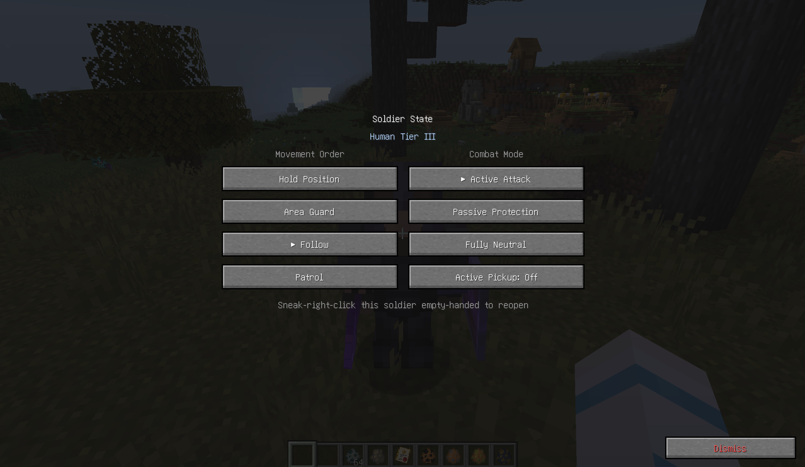
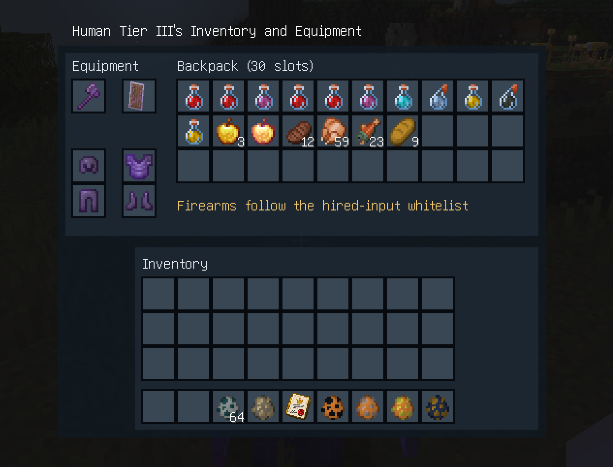

# Hostile Humans Unified

[简体中文](README.md) | [English](README.en.md)

Derived from [Hostile Humans](https://www.curseforge.com/minecraft/mc-mods/hostile-humans), this mod brings together content from **Human Gunner** and adds original gameplay. It is a standalone Forge mod; the original Hostile Humans and Human Gunner JARs are not required. The mod enhances hostile humans' attributes, combat, and survival mechanics, and is suited to modded worlds and modpacks. GPT assisted with modifications and builds.

## Gameplay

The mod adds Roamers and Tier I, II, and III humans, each with distinct attributes, equipment, and combat capabilities. Identity badges and faction relationships determine how humans treat players: as enemies, neutrals, or people to protect.

Players can hire humans with contracts and manage their roster through a radio. Hired soldiers can follow, guard an area, hold a position, or patrol. Their combat modes include Active Attack, Passive Protection, and Fully Neutral. Players can open a soldier's inventory to manage weapons, armor, and other equipment, change item pickup behavior, or dismiss the soldier.

Humans use melee weapons, shields, bows, crossbows, tridents, or firearms according to their equipment. At low health they retreat and try to recover. Ranged units look for firing positions while melee units pursue their targets. Signal flares summon temporary allies or hostile humans; the radio shows soldier status and can recall them.

## Mod Compatibility

- **TaCZ**: Optional firearm integration. With TaCZ installed, gunners can use firearms and display aiming, firing, and reloading animations.
- **Better Combat**: Optional melee integration. Soldiers can use its attack cooldowns, ranges, and area attacks. Without it, they fall back to this mod's combat logic. The integration can be adjusted in the configuration.
- **Curios**: Optional accessory integration. Identity badges can be placed in a dedicated badge slot.
- **Spartan Weaponry, Spartan Shields, and Immersive Armors**: Compatible weapons, shields, and armor are detected automatically, with no extra configuration.

These are optional integrations, not required dependencies.

## Screenshots

**Soldier commands**

**Soldier inventory and equipment**

## Installation and Configuration

Requires Minecraft 1.20.1 and Forge. Place the unified mod JAR in the instance's `mods` folder. Do not install separate Hostile Humans or Human Gunner JARs alongside it.

The main configuration is `config/hostile_humans_unified.json`. It covers tier attributes and weapon spread, natural spawning, combat behavior, hiring limits, damage multipliers, and TaCZ firearm settings. See the [configuration guide](CONFIGURATION.md) for details. In multiplayer, the server configuration controls gameplay.

## License and Credits

The unified release is licensed under the GNU GPL v2.0; see the full text in the repository root [`LICENSE`](LICENSE). Source incorporated from Human Gunner retains its original MPL-2.0 notices and, where permitted by MPL-2.0, is additionally distributed under GPL terms as part of this larger work. See [`THIRD_PARTY_NOTICES.md`](src/main/resources/THIRD_PARTY_NOTICES.md) for component provenance and license details.
