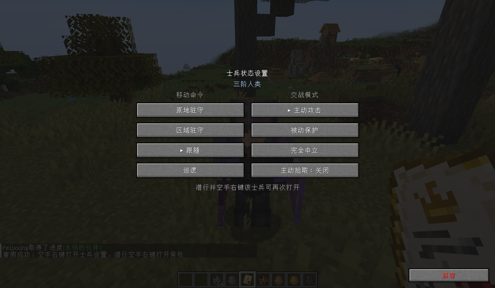
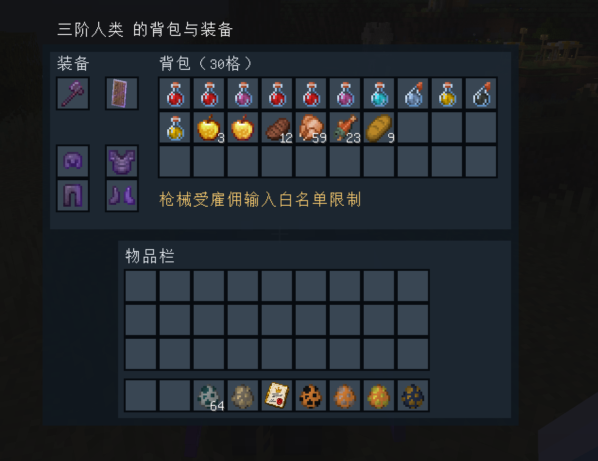

# Hostile Humans Unified 3.1.26-unified

[简体中文](README.md) | [English](README.en.md)

本模组由原模组 [**Hostile Humans**](https://www.curseforge.com/minecraft/mc-mods/hostile-humans) 修改衍生，并整合了 **Human Gunner** 的相关内容。同时，本模组也加入了一些原创的新内容。它可以单独安装使用，不需要另外安装原版 Hostile Humans 或 Human Gunner。本模组的修改与构建过程中使用了 GPT 辅助。本版本由第三方维护，并非原作者发布的官方更新。本模组强化了敌对人类的大部分数值与机制，因此在以原版内容为主的环境中游玩时可能会有较高难度，建议搭配其他模组或整合包使用。

面向 Minecraft 1.20.1 / Forge 47.4.16 / Java 17。运行时只需安装一个整合版 JAR；TaCZ 和 Curios 为可选兼容项：TaCZ 提供枪械支持，Curios 提供专属身份牌饰品栏。

## 模组简介

模组加入流浪者、一阶、二阶和三阶人类单位，以及身份牌、雇佣合同、士兵指挥界面和信号装置。野生人类会依据阶级、玩家身份和双方关系采取敌对、中立或保护行动；玩家也可以招募符合条件的人类作为随从，并管理他们的装备、作战方式和行动区域。

身份牌放在背包任意格即可生效；安装 Curios 后，也可以将身份牌放入专属饰品栏。雇佣人类可以设置跟随、区域驻守、原地驻守和巡逻，并在主动攻击、被动保护与完全中立模式间切换。玩家还可以打开其背包管理装备、设置主动拾取或解除雇佣。

### 界面截图

**雇佣人类命令面板**



**雇佣人类背包与装备界面**



随从可根据装备使用近战武器、盾牌、弓、弩、三叉戟或 TaCZ 枪械。低血量时会尝试撤离并恢复，生命值危急时会提醒主人。对讲机可查看雇佣名册并召回随从；援军信号弹可召来临时友军，敌对信号弹则会召来锁定玩家的敌军。

## 配置文件

主配置文件为 `config/hostile_humans_unified.json`，包括 `tiers`（各阶属性与散布）、`damage`（伤害倍率）、`spawning`（自然刷新与密度）、`ai`（战斗行为）、`recruitment`（雇佣人数上限与玩家间伤害）和 `tacz`（枪械生成、伤害、类型权重及白黑名单）。修改后请完整重启游戏；多人游戏中服务器端配置决定实际玩法。文件必须保持合法 JSON 格式，不能添加 `//` 注释。

`roamer`、`tier1`、`tier2`、`tier3` 分别对应流浪者、一阶、二阶和三阶人类。各阶枪械散布基准在 `tiers.<阶级>.gun_spread_degrees` 设置；弓和三叉戟使用 `projectile_spread_degrees`，弩比相同阶级的该基准低 0.5 度。三个旧移动速度字段仅为兼容旧配置保留，不再决定实际移动速度。

Waystones 等结构联动开关仍位于单独的 `config/hostile_humans.toml`，不会由统一 JSON 替代。完整字段说明见 [`CONFIGURATION.md`](CONFIGURATION.md)。

## 维护说明

- 维护版本号以 `build.gradle` 为准。源码每次修改后都需要重新构建并进行适当的验收；既有测试记录不能替代当前版本的验证。
- 兼容基线为 Minecraft 1.20.1、Forge 47.4.16 和 Java 17。TaCZ 与 Curios 是可选集成；没有 TaCZ 时使用普通武器 AI。
- 主配置为 `config/hostile_humans_unified.json`；旧版本体或附属模组不会读取此统一配置。Waystones 等结构联动设置仍位于 `config/hostile_humans.toml`。
- 配置默认值位于 `src/main/resources/defaults/hostile_humans_unified.json`；逐字段说明见 [`CONFIGURATION.md`](CONFIGURATION.md)。
- 来源信息与第三方声明见 `provenance.json`、`NOTICE.md` 和 `src/main/resources/THIRD_PARTY_NOTICES.md`。
- 不要将本地 `build/`、`.gradle/`、`logs/`、存档或整合包复制到公开仓库；常见生成物已由 `.gitignore` 排除。

## 为什么还保留两个 modId

同一个 JAR 保留 hostile_humans 与 humangunner 两个 Forge 注册身份，
用于延续实体、物品、配方、配置和存档引用；模组列表可能显示两个条目，
但并没有第二个附属 JAR，也没有继续向旧本体注入代码。
保留旧包名是兼容措施，不是继续依赖旧二进制。
两端网络协议已升级，不支持新旧版本客户端/服务端混连。

## 模块与维护位置

| Module | Interface / 职责 | 主要位置 |
|---|---|---|
| 所有权索引 | assign / owner / members，索引迁移、移除和不可变快照 | dev/felix/hostilehumans/core/OwnerIndex |
| 同步队列 | offer / drain，合并重复请求、FIFO、每刻预算 | dev/felix/hostilehumans/core/BudgetedUpdates |
| 存档 | 保持 HumanMobs 数据格式，按世界保存，无静态服务器单例 | entity/data/HumanServerData |
| 生命周期 | 只排队 UUID 与维度，不持有实体；停止时释放队列 | entity/data/HumanManagerEventHandler |
| 指令网络 | 指定方向、限制字符串长度、所有权/距离/会话/频率校验 | network/ 与 HumanCommandNetwork |
| 战斗 | 武器 Goal 一次安装，直接调用；连击属性 finally 恢复 | entity/entities/Human 与 humangunner 战斗类 |
| 寻路 | 人类专用节点分类，预算限制，不修改其他生物 | entity/ai/HumanNavigation |
| 生成/位置 | 自然生成准入、队伍预算、信号弹、已加载区块安全落点 | NaturalHumanSpawnRules / SafePositions |
| 生存关系 | 身份牌、合同、正式雇佣账本、临时援军、士兵命令 | humangunner 生存关系类 |
| 外部 Adapter | Minecraft/第三方模组所需的少量钩子 | 两个 mixin 包 |

内部 Mixin 已全部移入目标源码；只保留 13 个面向 Minecraft/第三方模组的兼容类。
不存在以旧 hostile_humans / humangunner 类为目标的内部注入。
未把所有成熟 AI 重新发明一遍：仍有经过还原和维护的旧 AI 实现，以及 Forge 1.20.1
兼容接口的弃用警告。不能据此声称完全没有旧代码、零风险，或承诺实际 TPS 提升。

## 重点变化

- 取消启动时联网下载名单；仅限量读取已有本地名字文件，不向外发请求或改写缓存。
- 存档索引改为实例数据；主人变更会移除旧索引，删除不再扫描所有玩家。
- 损坏/不支持的单条记录保留原始 NBT，不因为某条记录失败丢弃整个数据文件。
- 移除数据对象对实体/维度的强引用；客户端退出后清空客户端数据。
- 常规更新统一排队，每服务器刻最多 32 条；注册、离开和明确的业务变更可立即保存。
- 删除跨玩家共用的上一包缓存；支持清空列表同步，并实现原先空的单条客户端处理器。
- 异步世界生成不访问 SavedData；需要的装备初始化延后到实体首个服务器刻，不丢弃实体。
- 弓/弩/枪/三叉戟直接实现；不在战斗中修改 GoalSelector；连击不再覆写攻击基础值。
- TaCZ 枪手在无目标的空闲期会用原生换弹流程补满当前主手枪弹匣；客户端播放该枪的空仓或战术换弹音效。此项源码变更尚待构建和游戏内验证。
- 删除旧的三叉戟回收复制路径，保留禁止拾取与限时销毁的弹药实现。
- 寻路节点倍率从 50 降为 2；撤销人类全局高频重算路径补丁。
- 箱子查找改查已加载区块的方块实体，每次最多检查 1024 项，不再扫描 16000 个方块。
  箱子预约按世界隔离，过期清理最多每 20 刻执行一次。
- 临时支援兵可由召唤者在持续期间持对应合同正式雇佣；否则到期移除；命令每刻只处理一次；
  驻守/巡逻不依赖主人在线；传送/巡逻不盲目加载区块或使用洞穴顶层高度。
- 装备数据重载使用不可变快照原子替换；保留现有枪械配置与生存数值。
- 保留 5 张友善身份牌、4 张合同、8 种信号弹及其已有纹理；
  敌对身份牌仍未启用；终极牌配方仍为原版工作台、4 个下界合金块等原有材料。

## 构建

工程在当前工作区的标准位置为 HostileHumansUnified-维护/project。
编译依赖从只读官方基线 versions/Create-Delight-Remake/mods 读取 TaCZ 与 Curios；
由于当前官方基线未安装车万女仆，女仆 API 暂从最初二创内容/mods 的已知 1.5.3 JAR 读取。
三者都只是 compileOnly 兼容输入，不打入产物，运行时仍按实际安装模组启用。
更换这些第三方版本后需重新检查对应兼容代码。

在本目录 PowerShell 执行：

```powershell
$env:JAVA_HOME = 'D:/Java/17'
.\gradlew.bat clean build --offline
```

没有依赖缓存的机器先去掉 --offline。Gradle 固定 8.8，ForgeGradle 固定 6.0.54。
构建脚本没有 runClient 或 runServer 启动配置。
独立克隆不包含本地整合包的编译依赖。请自行合法取得 TaCZ 1.1.8、Curios 5.14 和
Touhou Little Maid 1.5.3 的兼容 API JAR，分别传入 `-PtaczApiJar=<路径>`、
`-PcuriosApiJar=<路径>`、`-PmaidApiJar=<路径>`；这三份 JAR 仅用于编译，不打入产物。
当前本地维护工作区仍可使用原有默认路径。产物文件名以 build.gradle 的 version 为准，
当前为 build/libs/hostile-humans-unified-1.20.1-3.1.26-unified.jar。

check 会运行 EncounterCooldownTest、RuntimePoliciesTest、UnifiedConfigTest、OptionalRuntimeTest
和 StructureCompatTest、RecruitmentCombatTest。OptionalRuntimeTest 在不含 TaCZ / Curios / 女仆的真实 JVM classpath 上加载核心类并解析签名，
测试无枪适配器；不初始化游戏、不启动 Forge 实例，不等同于实机启动测试。
tools/verify_package.py 使用 Python 3.11+，要求显式传入构建包、两个原包、
Forge SRG JAR 和 JDK 17 路径；只读核对，不启动游戏。
工具默认从原包所在 mods 目录解析外部兼容依赖；原包已归档时用 --compat-mods 指定当前 mods，
不把这些依赖打包。审计同时检查 datapacks，24 项有意修改须匹配 tools/structure_compat_repairs.json 的前后哈希。
StructureCompatTest 从最终 JAR 读取真实包元数据和 NBT，含缺失/损坏包故障注入；对应错误日志是预期测试输出。
维护工具 sanitizeStructureWaystones 默认只读；仅显式 -PapplyStructureRepair 才应用已审阅的结构转换，不属于日常构建任务。

## 安装、回滚与验收

维护工作区的《迁移与验收.md》位于上层，不属于此源码目录。
不要与两个旧 JAR 同时安装。
真实存档验收必须先完整备份，在复制的实例/存档中进行。
未实机验收前不要向公共整合包发布此候选包。

## 来源与第三方声明

本项目保留来源、作者与第三方组件信息，详见 `provenance.json`、`NOTICE.md` 和 `src/main/resources/THIRD_PARTY_NOTICES.md`。
