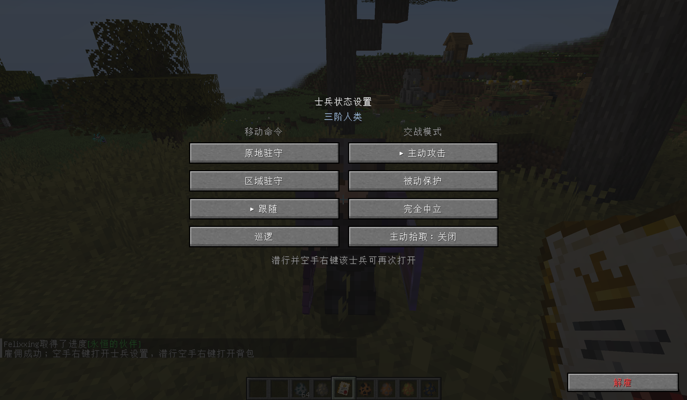
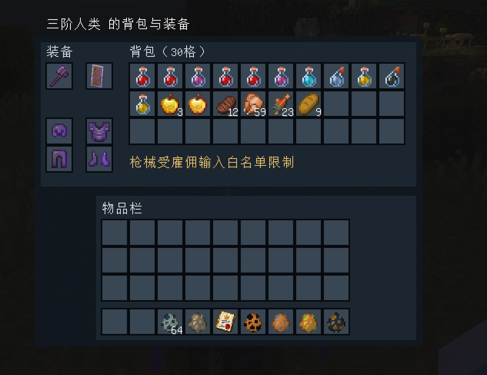

# Hostile Humans Unified

[简体中文](README.md) | [English](README.en.md)

由原模组 [Hostile Humans](https://www.curseforge.com/minecraft/mc-mods/hostile-humans) 修改衍生，整合 **Human Gunner** 的相关内容，并加入原创玩法。这是一个可独立安装的 Forge 模组，不需要另外安装原版 Hostile Humans 或 Human Gunner。模组强化了敌对人类的属性、战斗与生存机制，适合搭配其他模组或整合包游玩。模组的修改与构建过程使用了 GPT 辅助。

## 核心玩法

模组加入流浪者、一阶、二阶和三阶人类。不同阶级拥有不同的属性、装备与战斗能力。人类会根据身份牌和阵营关系决定如何对待玩家：敌对、保持中立，或成为玩家的保护者。

玩家可以使用合同雇佣人类，并通过对讲机管理名册。已雇佣的人类可以设置跟随、区域驻守、原地驻守或巡逻，并选择主动攻击、被动保护或完全中立。玩家还可以打开士兵背包，管理武器、护甲和其他装备，调整主动拾取设置，或解除雇佣。

人类会根据装备使用近战武器、盾牌、弓、弩、三叉戟或枪械。低血量时会撤退并尝试恢复；远程单位会寻找攻击位置，近战单位会追击目标。信号弹可以召来临时援军或敌对人类；对讲机可查看士兵状态并召回他们。

## 模组兼容

- **TaCZ**：可选枪械兼容。安装后，枪手可使用枪械，并显示瞄准、射击和换弹动作。
- **Better Combat**：可选近战兼容。士兵可使用其攻击冷却、攻击范围与范围攻击；未安装时自动使用模组自身的战斗逻辑。兼容开关可在配置文件中调整。
- **Curios**：可选饰品栏兼容，可将身份牌放入专属身份牌栏位。
- **Spartan Weaponry、Spartan Shields、Immersive Armors**：安装后自动识别兼容武器、盾牌和盔甲，无需额外配置。

这些都是可选兼容模组，不是本模组的运行依赖。

## 界面预览

**士兵命令面板**

**士兵背包与装备**

## 安装与配置

适用于 Minecraft 1.20.1 Forge。将统一版 JAR 放入实例的 `mods` 文件夹即可；不要同时安装独立的 Hostile Humans 或 Human Gunner JAR。

配置位于 `config/hostile_humans_unified/`，按属性、自然生成、装备、战斗、雇佣、TaCZ 和兼容开关拆为七个 JSON 文件，保留中英文说明。旧单文件配置会自动迁移并保留备份，不重置自定义设置。可调整分阶解锁日期、随日期成长的装备品质、四阶装备池、属性与散布、战斗行为、雇佣费用及枪械名单等。装备自定义直接使用配置文件，不再使用旧装备数据包。完整说明见[配置文件指南](CONFIGURATION.md)。多人游戏以服务器配置为准。

## 许可证与来源

本模组统一发行版使用 GNU GPL v2.0，完整文本见仓库根目录 [`LICENSE`](LICENSE)。整合自 Human Gunner 的源码保留原有 MPL-2.0 声明，并在 MPL-2.0 允许的范围内作为较大 GPL 作品的一部分同时按 GPL 条款发布。组件来源及许可说明见 [`THIRD_PARTY_NOTICES.md`](src/main/resources/THIRD_PARTY_NOTICES.md)。
